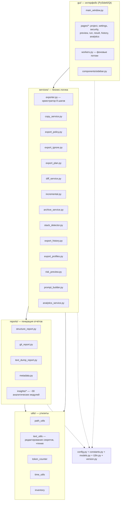
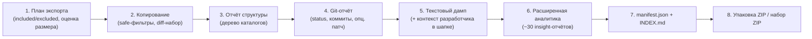
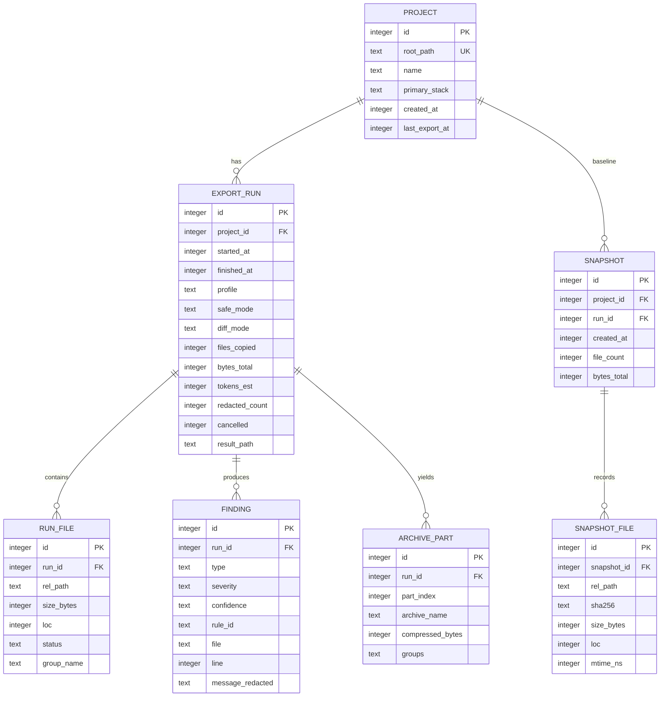

# BLUEPRINT — Project Exporter Desktop (codepack)

> **Единый документ-первоисточник (Single Source of Truth).**
> Здесь собрано всё: что уже реализовано, что предлагается добавить и как это будет
> устроено при переписывании на **Rust + Tauri**. Документ пишется для людей —
> от нетехнического специалиста до senior-инженера — и одновременно как техническое
> задание на новую реализацию.

- **Продукт:** Project Exporter Desktop (кодовое имя репозитория — `codepack`)
- **Текущая версия:** 1.0.1
- **Текущий стек:** Python 3.11+ · PySide6 (Qt) · PyInstaller · Inno Setup · только Windows
- **Целевой стек:** Rust (ядро) · Tauri (десктоп-оболочка) · веб-фронтенд · SQLite · кроссплатформенность (Windows / macOS / Linux)
- **Дата ревизии документа:** 2026-07-22
- **Статус:** рабочий блюпринт (living document)

---

## 0. Как читать этот документ (карта для разных читателей)

Документ большой намеренно — он заменяет собой десяток разрозненных заметок.
Не нужно читать всё подряд. Найдите свою роль:

| Кто вы | Начните с разделов | Можно пропустить |
|---|---|---|
| **Нетехнический специалист / заказчик** | §1 Что это, §2 Сценарии, §3 Глоссарий | §D, §E, §C.3 |
| **Начинающий программист** | §1–§3, §A (обзор), §B (что добавляем) | §E (математика) — по желанию |
| **Fullstack / senior** | §A целиком, §B, §C, §D | — |
| **Системный / ПО-архитектор** | §A.1, §C, §D, §F, §G | §3 глоссарий |
| **Архитектор БД** | §A.11, §D целиком | §A.10 GUI |
| **Математик / расчётчик** | §E целиком, §A.4, §A.8 | §A.10, §3 |
| **Технический писатель** | §2, §3, §A.7, §B.9, приложения | §E |

Значок 💡 **«Простыми словами»** — короткое объяснение без жаргона.
Значок ⚙️ — техническая деталь реализации.
Значок 🎯 — предложение/новшество (ещё не реализовано).

---

## 1. Что это за продукт (Vision)

**Project Exporter Desktop** — настольное приложение, которое берёт папку с кодом проекта
и превращает её в **чистый, безопасный и удобный «снимок» (snapshot)**: архив и набор
отчётов, которые не стыдно и не опасно отдать кому-то на изучение.

💡 **Простыми словами.** Представьте, что вам нужно показать свой проект другому человеку
или искусственному интеллекту (ChatGPT, Claude, Codex). Просто заархивировать папку —
плохо: туда попадут гигабайты служебных файлов (`node_modules`), а также **секреты** —
пароли, ключи, токены. Это приложение автоматически:
1. выбрасывает мусорные и тяжёлые папки;
2. находит и **замазывает секреты** (пароли, ключи), чтобы они не утекли;
3. собирает понятные отчёты о проекте (из чего он состоит, насколько «здоров», где риски);
4. упаковывает всё в архив и/или готовит текст для вставки в чат с ИИ.

Ключевая двойная аудитория результата:

- **Машина (ИИ-ассистент).** Пакеты `AI_CONTEXT/`, `AI_PROMPTS/`, оценка размера в токенах,
  пресеты под конкретные модели.
- **Человек (программист, команда, джун, техлид, нетехнический специалист).** Отчёты
  о структуре, здоровье, безопасности, зависимостях, архитектуре; HTML-дашборд;
  человекочитаемые сводки.

> **Принцип №1 — приватность.** Вся аналитика выполняется **локально, без сети**.
> Ничего не отправляется наружу без явного действия пользователя.
> **Принцип №2 — неизменность источника.** Исходная папка проекта **никогда** не
> модифицируется; всё делается на копии.

---

## 2. Пользовательские сценарии (для кого и зачем)

| Персона | Задача | Что использует |
|---|---|---|
| **Соло-разработчик** | «Отдать проект в ChatGPT на ревью, не залив секреты» | Пресет ChatGPT, Safe mode, редактирование секретов, буфер обмена |
| **Senior / техлид** | «Полный контекст в Claude для рефакторинга» | Пресет Claude Code, `ai_review`-профиль, Git-патч, dependency graph |
| **Команда** | «Единые правила экспорта на всех» | `.exportignore`, профили, (🎯 проектный конфиг) |
| **Аудитор безопасности** | «Найти секреты и опасные паттерны перед публикацией» | Security-профиль, SARIF, security scan, risk preview |
| **Онбординг нового разработчика** | «Быстро понять незнакомый проект» | Онбординг-пресет, runbook, architecture map, key files |
| **Нетехнический специалист** | «Понять, что это за проект и здоров ли он» | HTML-дашборд, health score, summary (🎯 человекочитаемый PDF-отчёт) |
| **CI/автоматизация** | «Генерировать AI-контекст на каждый PR» | 🎯 CLI/headless-режим |

---

## 3. Глоссарий (для начинающих и нетехнических читателей)

| Термин | Простое объяснение |
|---|---|
| **Экспорт / снимок (snapshot)** | Готовый набор файлов и отчётов, созданный приложением из вашего проекта. |
| **Дамп (text dump)** | Один большой текстовый файл, куда склеено содержимое всех текстовых файлов проекта. |
| **Стек (stack)** | Технологии проекта: язык и инструменты (Node.js, Python, Go, Rust и т.д.). |
| **Токен (token)** | Кусочек текста, которым «мыслит» ИИ (примерно 3–4 символа). У моделей есть лимит токенов. |
| **Контекстное окно** | Сколько токенов ИИ может принять за раз (напр. 200 000). |
| **Секрет (secret)** | Пароль, API-ключ, токен доступа, приватный ключ — то, что нельзя показывать посторонним. |
| **Редактирование секретов (redaction)** | Замена секрета на `<REDACTED>`, чтобы он не утёк. |
| **Staging (стейджинг)** | Временная папка, куда собирается копия перед упаковкой в архив. |
| **Diff / дифференциальный экспорт** | Экспорт только того, что изменилось, а не всего проекта. |
| **Git** | Система контроля версий: хранит историю изменений кода. |
| **SARIF** | Стандартный формат отчёта о проблемах безопасности, понятный другим инструментам. |
| **Манифест (manifest)** | Служебный JSON-файл с описанием того, что именно вошло в экспорт. |
| **LOC** | Lines of Code — количество строк кода. |
| **Health score** | Оценка «здоровья» проекта в баллах (архитектура, безопасность и т.д.). |
| **Tauri** | Технология для настольных приложений: веб-интерфейс + быстрое ядро на Rust. |
| **Crate** | Модуль/пакет в языке Rust (аналог библиотеки). |

---

# ЧАСТЬ A. ЧТО УЖЕ РЕАЛИЗОВАНО (текущая версия 1.0.1)

## A.1 Архитектура (слои)

Приложение построено слоями. Ниже — карта каталогов `src/project_exporter_desktop/`.



**Ключевая развязка:** GUI знает про `services`, но `services`/`reports` **не знают про GUI**.
Связь с интерфейсом — только через `Queue[str]` (лог/прогресс) и `threading.Event` (отмена).
Это делает всё ядро headless-совместимым — важно для будущего CLI и для порта на Rust.

⚙️ **Объём:** ~13 400 строк Python, ~85 модулей, 22 тестовых модуля.

---

## A.2 Конвейер экспорта — 8 шагов (`services/exporter.py`)

Сердце приложения — класс `ProjectExporter`, выполняющийся в фоновом потоке.
Прогресс и логи идут через очередь; отмена — через `cancel_event`.



Точная последовательность и побочные эффекты (по коду `run()`):

1. **Построение плана** (`build_export_plan`): обход дерева с учётом `IGNORED_DIR_NAMES`,
   стек-исключений, `.exportignore`, diff-набора. Пишет `28_export_plan.json/.md`,
   `29_export_comparison_report.md`. Логирует `included/excluded/estimated`.
2. **Копирование** (`copy_project`): копия в `staging/<project>/…` с применением
   safe-режима, diff/incremental-набора и пользовательских переопределений включения.
   Символические ссылки пропускаются (защита от выхода за пределы).
3. **Структура** (`write_structure_report`): PowerShell-подобное дерево скопированного проекта.
4. **Git** (`write_git_report`): read-only снимок из **оригинала** (не копии) — status,
   последние коммиты; опционально патч; с редактированием секретов.
5. **Текстовый дамп** (`write_text_dump`): склейка всех текстовых файлов. Если задан
   **контекст разработчика** — он вставляется в **начало** дампа отдельной шапкой.
6. **Аналитика** (`write_project_insight_reports`): генерация insight-отчётов по профилю
   (см. §A.7) + `AI_CONTEXT/`, `AI_PROMPTS/`, HTML-дашборд, `CUSTOM_PROMPT.md`.
7. **Метаданные** (`write_manifest`, `write_index_md`): машиночитаемый и человекочитаемый
   индексы того, что вошло в бандл.
8. **Архивация** (`build_final_archives`): один ZIP или логически разбитый набор (см. §A.8).
   Манифест обновляется до и после архивации через `pre_archive_hook`.

**После пайплайна:**
- запись в **историю экспортов** (снимок SHA-256 хэшей — только при успешном прогоне);
- оценка размера итога в **токенах**;
- удаление staging-папки (если не включено «сохранять staging»).

⚙️ **Отмена в любой момент:** после каждого шага проверяется `cancel_event`. При отмене
сохраняется то, что успело собраться, но история/снапшот-базлайн не перезаписываются.

---

## A.3 Модель конфигурации (`config.py`)

Все настройки хранятся в одном dataclass `Config`, сериализуемом в JSON
(`~/.project_exporter_desktop.json`). Полный перечень полей:

| Поле | Тип | По умолч. | Назначение |
|---|---|---|---|
| `last_root` | str | `~` | Последняя выбранная папка проекта |
| `text_file_size_limit_enabled` | bool | false | Включён ли лимит размера текстового файла |
| `max_text_file_mb` | int | 5 | Порог размера текстового файла (МБ) |
| `redact_secrets` | bool | true | Замазывать ли секреты |
| `keep_staging_folder` | bool | false | Оставлять ли временную папку |
| `include_project_in_zip` | bool | true | Класть ли копию проекта в ZIP |
| `extra_ignored_dirs` | list | [] | Доп. исключаемые папки |
| `export_profile` | str | `full` | Профиль экспорта (см. §A.7) |
| `safe_export_mode` | str | `safe` | Режим безопасности: safe/balanced/full |
| `zip_part_limit_mb` | int | 512 | Жёсткий лимит части архива |
| `diff_export_mode` | str | `all` | Режим diff: all/last_export/git_ref/uncommitted |
| `diff_base_ref` | str | `HEAD` | База для git-diff |
| `diff_target_ref` | str | `""` | Цель для git-diff |
| `include_git_patch` | bool | false | Включать ли git-патч |
| `custom_excluded_files` | list | [] | Пользовательские исключения файлов |
| `custom_excluded_extensions` | list | [] | Пользовательские исключения расширений |
| `always_include_files` | list | [] | Всегда включать эти файлы |
| `always_include_dirs` | list | [] | Всегда включать эти папки |
| `incremental_export_enabled` | bool | false | Инкрементальный режим |
| `developer_context` | str | `""` | Текст-задача, попадает в шапку AI-дампа |
| `theme` | str | `system` | Тема: system/light/dark |
| `watch_enabled` | bool | false | Watch-режим |
| `watch_clipboard_auto_update` | bool | false | Авто-обновление буфера при изменениях |
| `ui_zoom` | float | 1.0 | Масштаб интерфейса (0.7–1.5) |
| `language` | str | `ru` | Язык интерфейса: ru/en |
| `prompt_goals` | list | [architecture_review, bug_hunt, write_tests] | Цели для генерации промптов |

⚙️ **Валидация/нормализация.** Все «сырые» значения проходят через `normalized_*`-методы,
которые откатывают неизвестные значения к безопасным дефолтам. Есть **миграция legacy-настроек**
(`_migrate_legacy_settings`). Настройки можно **экспортировать/импортировать** файлом.

Второй файл — `~/.project_exporter_profiles.json` — пользовательские профили экспорта.

---

## A.4 Система безопасности (ядро ценности)

Три независимых механизма работают вместе.

### A.4.1 Режимы безопасного экспорта (`export_policy.py`)

Решают, **какие файлы вообще не копировать**:

| Режим | Что исключает |
|---|---|
| **safe** (строгий) | секреты, приватные ключи, локальные БД, дампы, архивы; суффиксы: `key,pem,p12,pfx,crt,cer,keystore,jks,db,sqlite,sqlite3,bak,dump,backup,7z,rar,tar,gz,xz,zip`; имена по «secret/credential/private» |
| **balanced** | только жёсткие учётные данные и ключи (`.env`-файлы кроме примеров, суффиксы `key/pem/…,bak,dump,backup`) — больше конфигурации сохраняется |
| **full** | ничего не фильтрует (только для приватных/локальных экспортов) |

💡 `.env.example` и `.env.sample` считаются **безопасными** (это шаблоны без реальных значений)
и не исключаются, тогда как реальный `.env` — исключается.

### A.4.2 Редактирование секретов в содержимом (`text_utils.redact_secrets`)

Даже если файл **включён** (например, конфиг), его строки прогоняются через regex и
секреты заменяются на `<REDACTED>`. Действует и в ZIP-дампе, и в **буфере обмена**
(быстрый путь не течёт). Паттерны (`constants.py`):

- `API_KEY | SECRET | TOKEN | PASSWORD | PASS | PRIVATE_KEY` со значением после `:`/`=`;
- `BEARER <token>` (≥16 символов).

### A.4.3 Эвристический сканер (`reports/insights/security.py`) — «Enhanced Security Scan v3»

Пишет человекочитаемый `.txt` + машиночитаемые `.json` и **`.sarif`**. Находит:

- **Sensitive-looking files** — по именам/суффиксам (`.env`, `id_rsa`, `*.pem`, `credentials.json`…).
- **Potential secret-like lines** с градацией уверенности:
  - `critical` — строка вида `-----BEGIN … PRIVATE KEY-----`;
  - `high` — совпадение с `SECRET_PATTERNS`;
  - `medium` — присваивание секрет-подобному ключу;
  - `low` — упоминание ключевого слова вне комментария.
  - (самозащита: строки самого сканера с `SECRET_PATTERN` и т.п. игнорируются).
- **Risky code patterns** — `eval()/exec()`, `subprocess(shell=True)`, `pickle.load`,
  `yaml.load`, JS `eval`, `innerHTML=`, `document.write`, токены в `localStorage`.

⚙️ SARIF-выход делает находки совместимыми с GitHub Code Scanning и другими SAST-инструментами.

> **Честная оговорка (из самого отчёта):** это **эвристика**, не профессиональный
> secret-scanner/SAST. Это ровно та область, которую §B.1 предлагает усилить.

---

## A.5 Определение стека (`stack_detector.py`)

По маркер-файлам в корне определяется технологический стек и **какие папки дополнительно
исключать**. Правила:

| Стек | Маркеры | Исключаемые папки |
|---|---|---|
| Node.js | `package.json` | node_modules, .next, .nuxt, .turbo, .expo, out … |
| Python | `requirements.txt`, `pyproject.toml`, `setup.py`, `Pipfile` | .venv, venv, __pycache__, .mypy_cache, .tox, *.egg-info … |
| Go | `go.mod` | vendor |
| Rust | `Cargo.toml` | target |
| Java/Maven | `pom.xml` | target, .mvn |
| Java/Gradle | `build.gradle(.kts)` | build, .gradle, .idea |
| .NET/C# | `*.csproj`, `*.sln` | bin, obj, .vs |
| Flutter/Dart | `pubspec.yaml` | .dart_tool, build |
| PHP/Composer | `composer.json` | vendor |
| Ruby | `Gemfile` | .bundle, vendor/bundle |
| iOS/Swift | `Package.swift`, `*.xcodeproj` | .build, DerivedData |
| Android | `AndroidManifest.xml` | build, .gradle, .idea |

⚙️ Может определяться **несколько стеков** (моно-репозиторий). Приоритетный — тот, у кого
больше совпавших маркеров.

---

## A.6 Дифференциальный и инкрементальный экспорт (`diff_service.py`, `incremental.py`)

Позволяет отправлять ИИ **только изменения**, а не весь проект каждый раз.

| Режим | Как определяет изменения |
|---|---|
| **all** | без фильтра — весь выбранный проект |
| **last_export** | сравнение SHA-256 текущих файлов со **снимком последнего успешного экспорта** (из истории) |
| **git_ref** | `git diff --name-status --find-renames <base>..HEAD` |
| **uncommitted** | `git status --porcelain=v1 -z` (рабочее дерево + новые файлы) |

⚙️ **Снимок проекта** (`snapshot_project`) для каждого файла хранит `sha256`, `size`, `loc`,
`mtime_ns`. Хэширование потоковое (чанки по 1 МБ) — память не растёт на больших файлах.
Git-вывод парсится через NUL-разделитель (`-z`), чтобы не ломаться на пробелах в именах.
Удалённые файлы фиксируются в манифесте, но, естественно, не копируются.

Комбинирование наборов (в `exporter.combined_selected_paths`): пересечение diff- и
incremental-наборов, затем поверх накладываются пользовательские force-include/-exclude.

---

## A.7 Аналитика — ~30 insight-отчётов (`reports/insights/`)

Оркестратор (`orchestrator.py`) запускает набор «плагинов-отчётов». Каждый отчёт
привязан к набору профилей и запускается, только если активный профиль в него входит
(профиль `full` запускает всё). Профили и их назначение:

| Профиль | Назначение |
|---|---|
| `quick` | краткий обзор, запуск, ключевые файлы, профиль проекта |
| `full` | все отчёты и AI-контекст |
| `ai_review` | всё для понимания проекта ИИ и безопасного изменения кода |
| `security` | конфиг, зависимости, Git, качество кода, безопасность |
| `minimal` | компактный обзор для лёгкой передачи |

Полный каталог отчётов (из `REPORT_DESCRIPTIONS`):

| Файл | Что внутри |
|---|---|
| `PROJECT_PROFILE.json` | Машиночитаемый «паспорт» проекта: стек, команды, точки входа, возможности, уровень риска |
| `01_summary.txt` | Обзор: стек, счётчики языков, самые большие файлы |
| `02_file_statistics.txt` | Файлы по расширениям, самые глубокие пути, пустые/подозрительные |
| `03_dependencies.txt` | Зависимости из package.json/requirements/go.mod/Cargo.toml |
| `04_scripts.txt` | npm/pnpm-скрипты, цели Makefile, Docker-команды |
| `05_git_deep.txt` | Расширенный read-only Git (ветки, remotes, diff, ls-files) |
| `06_security_scan.txt/.json/.sarif` | Сканер секретов и рискового кода (см. §A.4.3) |
| `07_todo_fixme.txt` | Маркеры TODO/FIXME/HACK/XXX/DEPRECATED |
| `08_code_metrics.txt` | LOC, доля комментариев, файлы >500/1000 строк |
| `09_config.txt` | Найденные конфиг-файлы и чек-лист возможностей |
| `10_docker.txt` | Карта сервисов Dockerfile/compose |
| `11_routes_and_pages.txt` | Эвристическая карта UI: маршруты, страницы, компоненты |
| `12_ai_context_pack.md` | Готовая сводка для вставки в ИИ |
| `13_runbook.md` | Инструкции setup/run/test/Docker |
| `14_dependency_graph.md/.mmd` | Граф внутренних импортов (Markdown + Mermaid) |
| `15_architecture_report.md` | Слоистая карта архитектуры и точки расширения |
| `16_key_files_report.md` | Ранжированные важнейшие файлы с обоснованием |
| `17_code_quality_report.md` | Крупные файлы, длинные функции, дублирование |
| `18_api_surface_report.md` | Кандидаты бэкенд-маршрутов и фронтенд HTTP-вызовов |
| `19_frontend_report.md` | Компоненты, хуки, маршруты, сторы, формы |
| `20_backend_report.md` | API, сервисы, модели, репозитории, миграции, задачи |
| `21_git_timeline_report.md` | Недавние коммиты, контрибьюторы, churn файлов |
| `22_project_health_report.md` | Health score: архитектура, безопасность, поддерживаемость, документация, AI-готовность |
| `23_refactoring_opportunities.md` | Приоритизированные кандидаты на рефакторинг |
| `24_architecture_map.md` | Карта слоёв + точки входа + Mermaid |
| `25_large_files_report.md` | Инспектор больших файлов/папок |
| `26_dependency_intelligence.md` | Пакетные менеджеры, lock-файлы, гигиена зависимостей |
| `27_archive_plan.md` | План архива: один ZIP или логические части |
| `28_export_plan.md` | План до копирования: включённое/исключённое, предупреждения |
| `29_export_comparison_report.md` | Сравнение с предыдущим успешным экспортом |
| `REPORT_DASHBOARD.html` | Локальный HTML-дашборд навигации по отчётам |
| `AI_CONTEXT/` | Многофайловый контекст для ChatGPT/Codex |
| `AI_PROMPTS/` | Готовые промпты: ревью, рефакторинг, безопасность, поиск багов |

⚙️ **Отказоустойчивость:** падение одного отчёта не рушит экспорт — вместо него пишется
`ERROR_<имя>.txt` с трейсбеком, остальные продолжают.
⚙️ Каталог плагинов сериализуется в `REPORT_PLUGINS.json` — зачаток публичного плагинного API (см. §B.10).

---

## A.8 Архивация (`archive_service.py`)

- **Компрессия:** ZIP (`ZIP_DEFLATED`, уровень 6 — баланс скорость/размер).
- **Жёсткий лимит части:** 512 МБ; **целевой размер** части: 500 МБ; резерв 8 МБ на
  накладные расходы ZIP.
- **Логическая группировка** (`classify_archive_group`): файлы раскладываются по группам
  (`00_metadata`, `01_reports`, `02_ai_context`, `03_ai_prompts`, `20_tests`, `30_docs`,
  `40_python_source`, `41_frontend_source`, `42_backend_or_system_source`,
  `50_config_and_locks`, `60_assets`, `70_data`, …), затем упаковываются частями по группам.
- **Разбиение (split):** если оценка размера превышает целевой — набор ZIP-частей
  `<bundle>_part_001_<группа>.zip`. Если даже одиночный ZIP после записи превысил лимит —
  пересобирается частями.
- **Восстановление:** для набора частей пишутся `ARCHIVE_SET_MANIFEST.json`,
  `RESTORE_INSTRUCTIONS.md` и **`restore_archives.py`** — с защитой от path-traversal при распаковке.

---

## A.9 История экспортов и снапшоты (`export_history.py`)

Каждый успешный (и отменённый — с пометкой) экспорт добавляет запись:
время, имя проекта, корень, профиль, safe-режим, diff-режим, результат, список архивов,
краткую статистику копирования, **оценку токенов**, полный **снимок SHA-256** и его статистику.

Снимок служит базлайном для режима `last_export`. Отменённые/ошибочные прогоны **не**
перезаписывают базлайн. Страница «История» в GUI позволяет просматривать и сравнивать снимки.

---

## A.10 Графический интерфейс (`gui/`)

- **Мастер из 8 страниц:** Проект → Настройки → Безопасность → Предпросмотр → Журнал →
  Результат → История → Аналитика (боковая навигация).
- **Предпросмотр** — дерево файлов со статусами *included / excluded / warning*;
  пользователь может вручную включать/исключать файлы (переопределения).
- **Фоновая работа** (`workers.py`) — экспорт в отдельном потоке, стрим прогресса/лога,
  кнопка отмены.
- **Системный трей** — быстрый экспорт, открыть, выход.
- **Watch-режим** — слежение за изменениями проекта, опц. авто-обновление буфера обмена.
- **Темы** — светлая/тёмная/системная.
- **Масштаб UI** — Ctrl +/−/0 (в т.ч. numpad), сохраняется; шорткаты привязаны к пунктам
  меню «Вид» и переживают смену языка.
- **Двуязычие RU/EN** (`i18n.py`) — переключение без перезапуска; охватывает меню, метки,
  кнопки, диалоги, стандартные Yes/No/OK, фильтры файловых диалогов, сообщения валидации,
  историю, шапки clipboard-дампа.

> ⚠️ **Важное ограничение (по README):** содержимое **отчётов** и строки **прогресса лога**
> всегда на русском — это артефакты пайплайна, а не элементы интерфейса. См. §B.6.

---

## A.11 Хранилище данных (текущее состояние)

💾 Сейчас **нет базы данных** — всё в плоских файлах:

| Данные | Где | Формат |
|---|---|---|
| Настройки приложения | `~/.project_exporter_desktop.json` | JSON (dataclass `Config`) |
| Профили экспорта | `~/.project_exporter_profiles.json` | JSON |
| История экспортов + снапшоты | файл истории | JSON (список записей) |
| Логи | `%LOCALAPPDATA%\ProjectExporterDesktop\logs` | текст |
| Артефакты экспорта | Рабочий стол / выбранная папка | ZIP + отчёты |

**Проблемы такого подхода** (мотивация для §D): история со снапшотами SHA-256 растёт
линейно и целиком читается/пишется как один JSON; нет индексов, транзакций, частичных
запросов; конкурентный доступ не защищён. При переписывании — переход на **SQLite** (§D).

---

## A.12 Сборка, дистрибуция, тесты

- **Запуск из исходников:** `python main.py` или `python -m project_exporter_desktop`.
- **EXE:** PyInstaller (`tools/build_exe.py` → `dist/ProjectExporterDesktop.exe`).
- **Инсталлятор:** Inno Setup 6 (`tools/build_setup.bat`).
- **Тест-гейт (CI + локально):** `ruff format --check` → `ruff check` → `pytest` →
  `compileall` → `smoke_export.py`. **22 тестовых модуля** покрывают политики, diff/incremental,
  stack detector, i18n, валидацию путей, токен-счётчик, метаданные и др.
- **Линт-правила:** ruff `E,F,I,UP,B`, line-length 100, target py311.

---

# ЧАСТЬ B. НОВОВВЕДЕНИЯ И МОДЕРНИЗАЦИЯ (Roadmap)

> Принцип модернизации: **ничего из существующего не выбрасываем** — расширяем.
> В частности, оценка размера в **байтах остаётся** везде; токены добавляются рядом.

Приоритеты: **P0** — сделать первым (максимальный рычаг), **P1** — сильное усиление,
**P2** — ценно, **P3** — полировка.

## B.1 (P0) Настоящий детектор секретов

Дополнить keyword-эвристику (§A.4) двумя слоями:

1. **Провайдер-специфичные сигнатуры** (высокая точность, почти нет ложных срабатываний):
   - AWS Access Key `AKIA[0-9A-Z]{16}`, AWS Secret (по контексту);
   - GitHub `ghp_`, `gho_`, `ghu_`, `ghs_`, `github_pat_`;
   - Google API `AIza[0-9A-Za-z\-_]{35}`;
   - Slack `xox[baprs]-…`;
   - Stripe `sk_live_`, `rk_live_`;
   - OpenAI/совместимые `sk-…`, Anthropic `sk-ant-…`;
   - Telegram bot `\d{8,10}:[A-Za-z0-9_-]{35}`;
   - JWT `eyJ[A-Za-z0-9_-]+\.[A-Za-z0-9_-]+\.[A-Za-z0-9_-]+`;
   - приватные ключи PEM (уже есть — сохранить).
2. **Энтропийный анализ** (Шеннон, §E.2) — ловит случайные секреты **без** ключевого слова.

Каждая находка получает `rule_id`, `severity`, `confidence`; всё — в существующие
`.json` и `.sarif`. Приватность сохраняется: **без сетевой валидации** секретов.

🎯 **Для людей тоже:** понятная сводка «сколько и каких секретов найдено» в HTML-дашборде
и в человекочитаемом отчёте — не только SARIF для инструментов.

## B.2 (P1) Токенайзер рядом с байтами (байты остаются!)

`token_counter.py` сейчас: `T ≈ B / 3.5`. Улучшение — **не заменять, а уточнять**:

- Показывать **и байты, и токены** везде, где показываем размер (Preview, Result, история).
- Ввести **пофайловую** оценку токенов в Preview (видно, какой файл «съедает» контекст).
- Калибруемый коэффициент по типу контента (см. §E.1): код ASCII ≈ 3.6–4.0 симв/токен,
  кириллица UTF-8 — иначе. Опционально — точный токенайзер (BPE) как подключаемый бэкенд.
- Вынести `MODEL_CONTEXT_LIMITS` в **обновляемый JSON** (без релиза приложения),
  добавить актуальные окна до 1M токенов.

## B.3 (P1) Режим «Fit to budget» (уложить проект в N токенов)

Киллер-фича для ИИ-передачи. Пользователь задаёт бюджет (напр. 200K токенов) — приложение
**приоритизирует файлы** по уже существующему ранжированию (`16_key_files_report`,
`22_project_health_report`) и включает важное, обрезая/суммаризируя остальное.
Математика жадного отбора — §E.5.

## B.4 (P0 в контексте переписывания) Кроссплатформенность

Windows-only → Windows / macOS / Linux. В новой архитектуре (§C) это следствие выбора
Tauri + Rust, а не отдельная задача. Требует абстракции: пути, трей, автозапуск, места
хранения настроек (§D.4).

## B.5 (P1) CLI / headless-режим

Ядро уже развязано с GUI. Дать команду:

```bash
codepack export ./my-project --preset claude --budget 200k --out dump.zip --json
```

Открывает **CI/CD**: генерация AI-контекста в pre-commit, в GitHub Action, в скриптах.
Единый движок для GUI и CLI.

## B.6 (P2) Локализация отчётов и лог-строк

Сейчас отчёты и прогресс жёстко на русском (§A.10). Пропустить их через тот же i18n,
что и UI (минимум RU/EN), с выбором «язык артефактов» отдельно от «языка интерфейса».

## B.7 (P2) Проектный конфиг в репозитории

Помимо глобального `~/.…json` — **версионируемый** `.codepack.toml`/`.yaml` в корне
проекта, чтобы команда делила единые правила. Расширение уже читаемого `.exportignore`.

## B.8 (P2) Прямая интеграция с ИИ (по явному запросу пользователя)

Кнопка «Отправить в Claude/ChatGPT» с ключом пользователя: собрал контекст → задал вопрос
→ получил ответ прямо в приложении. **Только по явному действию**, ключ хранится в
защищённом хранилище ОС (§D.4), запрос — опционально, приватность по умолчанию.

## B.9 (P1) Человеко-ориентированные возможности (не только для ИИ!)

Пользователь особо подчеркнул: результат — и для людей. Предлагается:

- 🎯 **Человекочитаемый отчёт-обзор (PDF/HTML)** «Что это за проект» — для техлида,
  заказчика, нетехнического специалиста: стек, размер, здоровье, риски, диаграммы —
  без чтения кода.
- 🎯 **«Объясни простыми словами»** — секция в дашборде с плоским языком (что делает
  проект, из чего состоит, что рискованно), пригодная и для джуна.
- 🎯 **Режим ревью для команды** — экспорт с акцентом на изменения (diff) + чек-лист
  ревьюера + ссылки `файл:строка`.
- 🎯 **Онбординг-трек** — пошаговый маршрут «с чего начать читать проект» (на базе
  `key_files` + `runbook` + `architecture_map`).
- 🎯 **Интерактивный HTML-дашборд** — фильтры, поиск, сортировка по находкам/файлам,
  визуализация dependency graph (Mermaid уже генерируется — отрисовать в браузере).
- 🎯 **Экспорт диаграмм** (architecture map, dependency graph) в SVG/PNG для презентаций.

## B.10 (P3) Инженерное качество и экосистема

- **Публичный плагинный API** для insight-отчётов (уже есть `REPORT_PLUGINS.json`).
- **Статическая типизация** — mypy/pyright в текущем коде; в Rust — гарантируется компилятором.
- **Корпус тестов детектора секретов** — фикстуры реальных форматов токенов (замаскированные),
  метрики precision/recall.
- **Подпись кода (code-signing)** — снимает предупреждение SmartScreen; на macOS — нотаризация.
- **Инкрементальный watch** — кэш снапшота, чтобы не пересчитывать хэши всего проекта.

---

# ЧАСТЬ C. ЦЕЛЕВАЯ АРХИТЕКТУРА (Rust + Tauri)

## C.1 Почему Rust + Tauri

💡 **Простыми словами.** Tauri = современный интерфейс (HTML/CSS/JS в системном webview) +
быстрое и безопасное «ядро» на Rust. По сравнению с текущим Python+Qt:

- **Один код — три ОС** (Windows/macOS/Linux) из коробки.
- **Маленький и быстрый** бинарник (нет тяжёлого Python-рантайма; webview системный).
- **Безопасность памяти** и **бесстрашная многопоточность** Rust — идеально для параллельного
  обхода файлов, хэширования и сканирования.
- **Строгая типизация** ловит ошибки на компиляции, а не у пользователя.

## C.2 Высокоуровневая структура

```mermaid
flowchart TB
    subgraph FE["Frontend (webview) — TypeScript"]
        UI[UI: страницы-мастер, дашборд, предпросмотр]
        STATE[Состояние + i18n]
    end
    subgraph TAURI["Tauri bridge"]
        CMD[commands (invoke)]
        EVT[events (прогресс/лог)]
    end
    subgraph CORE["Rust core (workspace)"]
        direction TB
        C_CFG[crate: config]
        C_SCAN[crate: scanner — обход, стек, ignore]
        C_SEC[crate: security — сигнатуры + энтропия]
        C_DIFF[crate: diff — git2 + снапшоты]
        C_REP[crate: reports/insights]
        C_ARC[crate: archive — zip, split]
        C_TOK[crate: tokens — байты + токенайзер]
        C_DB[crate: storage — SQLite/rusqlite]
        C_ENG[crate: engine — оркестратор пайплайна]
    end
    FE <--> TAURI
    TAURI <--> C_ENG
    C_ENG --> C_SCAN & C_SEC & C_DIFF & C_REP & C_ARC & C_TOK & C_DB & C_CFG
```

- **Frontend** общается с ядром только через Tauri `invoke` (команды) и слушает **события**
  (прогресс, строки лога) — прямой аналог текущей `Queue[str]`.
- **Rust core** — cargo-**workspace** из независимых crate; тестируется без UI (как сейчас
  ядро тестируется без Qt) и переиспользуется в **CLI** (§B.5) — просто ещё один бинарник
  поверх `engine`.

## C.3 Карта соответствия: Python → Rust

| Сейчас (Python) | Цель (Rust) | Ключевые crates |
|---|---|---|
| `services/exporter.py` | crate `engine` | (собственный) |
| `os.walk` + `path_utils` | crate `scanner` | `ignore`, `walkdir` |
| `stack_detector.py` | `scanner::stack` | — |
| `export_ignore.py` (fnmatch, `.exportignore`) | `scanner::ignore` | `globset`, `ignore` |
| `export_policy.py` | `security::policy` | — |
| `text_utils.redact_secrets` + `insights/security.py` | crate `security` | `regex`, `aho-corasick` |
| `diff_service.py` (git subprocess) | crate `diff` | `git2` (libgit2, без subprocess) |
| хэширование SHA-256 | `diff::snapshot` | `sha2` |
| `archive_service.py` | crate `archive` | `zip`, `flate2` |
| `token_counter.py` | crate `tokens` | `tiktoken-rs` (опц.) |
| `reports/insights/*` | crate `reports` | `serde`, `tera`/`askama` (шаблоны) |
| JSON-настройки/история | crate `storage` | `rusqlite`/`sqlx`, `serde_json` |
| `i18n.py` | frontend i18n + `reports::i18n` | `fluent` (опц.) |
| PySide6 GUI | Tauri + webview | `tauri` |
| параллелизм (threads+Queue) | `rayon` + `tokio`/каналы | `rayon`, `crossbeam` |
| PyInstaller/Inno Setup | `tauri build` | tauri bundler (msi/nsis/dmg/AppImage/deb) |

## C.4 Модель конкурентности

- **Обход и хэширование файлов** — data-parallel через `rayon` (`par_iter`), что даёт
  почти линейное ускорение на многоядерных машинах (текущий Python ограничен GIL).
- **Прогресс/лог** — из воркеров в UI через канал (`crossbeam-channel`) → Tauri events.
- **Отмена** — `Arc<AtomicBool>` (аналог `threading.Event`), проверяется между шагами и
  внутри параллельных циклов.

## C.5 Frontend-стек (рекомендация)

Лёгкий и предсказуемый: **TypeScript + Svelte** (или React) + Vite; для Mermaid-графов —
рендер в браузере; тёмная/светлая тема из системной. Строгая изоляция: UI не имеет доступа
к ФС — только через команды Rust (безопасность Tauri по умолчанию).

---

# ЧАСТЬ D. МОДЕЛЬ ДАННЫХ (взгляд архитектора БД)

## D.1 Зачем БД вместо JSON

Переезд истории/снапшотов/кэша на **SQLite** (встраиваемая, без сервера, кроссплатформенная)
даёт: транзакции, индексы, частичные выборки, устойчивость к параллельному доступу и
контролируемый рост. Настройки можно оставить в файле **или** тоже в SQLite (единое хранилище).

## D.2 Схема (предлагаемая)



## D.3 Индексы, целостность, миграции

- **Индексы:** `PROJECT(root_path)` UNIQUE; `EXPORT_RUN(project_id, started_at)`;
  `SNAPSHOT_FILE(snapshot_id, rel_path)`; `FINDING(run_id, severity)`.
- **Целостность:** `PRAGMA foreign_keys = ON`; каскадное удаление прогонов вместе с их
  файлами/находками/частями.
- **Производительность:** `PRAGMA journal_mode = WAL` (конкурентные чтения при записи);
  вставки снапшот-файлов — одной транзакцией (батч).
- **Миграции:** таблица `schema_version`; аккуратные `ALTER`/пересоздание; **импорт из
  старых JSON** истории при первом запуске новой версии (обратная совместимость §G).
- **Ретеншн:** конфигурируемая политика хранения последних N прогонов на проект + очистка.

## D.4 Хранилище настроек и секретов (кроссплатформенно)

| Что | Windows | macOS | Linux |
|---|---|---|---|
| Настройки/БД | `%APPDATA%\codepack` | `~/Library/Application Support/codepack` | `~/.config/codepack` |
| Логи | `%LOCALAPPDATA%\codepack\logs` | `~/Library/Logs/codepack` | `~/.local/state/codepack` |
| API-ключи (§B.8) | Credential Manager | Keychain | Secret Service |

⚙️ В Rust — пути настроек/логов резолвятся вручную через переменные окружения
(`APPDATA`/`LOCALAPPDATA`/`HOME`/`USERPROFILE`/`XDG_CONFIG_HOME`), без крейта
`directories`/`dirs` — он тянет MPL-2.0-зависимость (`option-ext`), и владелец
предпочёл избежать copyleft вместо разрешения лицензии (решение от 2026-07-22,
`open-questions.md`). Для секретов ОС — крейт `keyring`.
**API-ключи никогда не пишутся в обычные файлы настроек.**

## D.5 Форматы артефактов (контракты остаются)

Внешние форматы — **обратно совместимы** с текущими, чтобы не ломать привычки/интеграции:
`PROJECT_PROFILE.json`, `manifest.json`, `06_security_scan.json`, **`.sarif` 2.1.0**,
`ARCHIVE_SET_MANIFEST.json`. Для каждого — версионирование через поле `schema_version`.

---

# ЧАСТЬ E. МАТЕМАТИЧЕСКОЕ ПРИЛОЖЕНИЕ (взгляд расчётчика)

## E.1 Оценка токенов (существующая + уточнённая)

**Сейчас:** для размера файла `B` байт число токенов
$$T \approx \left\lceil \frac{B}{3.5} \right\rceil, \quad T \ge 1.$$

💡 Это грубо: коэффициент 3.5 «байт на токен» верен для англоязычного кода в ASCII, но
для кириллицы в UTF-8 один символ занимает ~2 байта, поэтому оценка **завышается** в разы.

**Уточнение (сохраняя байты как основу).** Ввести коэффициент `k` (символов на токен) и
плотность байт на символ `b`:

$$T \approx \frac{C}{k} = \frac{B}{b \cdot k},$$

где `C` — число символов, `b` — среднее число байт/символ (ASCII-код ≈ 1.0, кириллица UTF-8 ≈ 1.9),
`k` — символов на токен (код ASCII ≈ 3.6–4.0; естественный язык — иначе). Калибровка `k`, `b`
по типу файла даёт заметно более точную оценку **без отказа от байтовой основы**.

**Точный путь (опция):** BPE-токенайзер (`tiktoken-rs`) для абсолютной точности там, где важно.

## E.2 Энтропия Шеннона для детекции секретов (§B.1)

Для строки-кандидата `s` с частотами символов `p_i`:

$$H(s) = -\sum_{i} p_i \log_2 p_i \quad \text{[бит/символ]}.$$

**Пороги (эвристика для отбора кандидатов):**
- base64-подобные секреты: `H ≳ 4.0` бит/символ при длине `≥ 20`;
- hex-подобные (например, ключи в hex): `H ≳ 3.0` бит/символ при длине `≥ 32`.

Комбинируем с проверкой алфавита (доля `[A-Za-z0-9+/=_-]`) и длины, чтобы отсечь обычные
слова. Высокая энтропия **плюс** контекст (`=`, `:`, имя переменной) → повышение `confidence`.

💡 **Простыми словами.** Настоящий секрет выглядит «случайно» (высокая энтропия), а обычный
текст — предсказуемо. Энтропия численно измеряет эту «случайность».

## E.3 Оценка ложных срабатываний детектора

Качество сканера меряем на корпусе (§B.10):

$$\text{Precision} = \frac{TP}{TP+FP}, \quad \text{Recall} = \frac{TP}{TP+FN}, \quad
F_1 = 2\cdot\frac{P\cdot R}{P+R}.$$

Цель усиления §B.1 — поднять **Recall** (ловить больше реальных секретов) провайдер-сигнатурами
и энтропией, не роняя **Precision** (не заваливать пользователя ложными).

## E.4 Bin-packing архивных частей (§A.8)

Разбиение на части — вариант **упаковки в контейнеры (bin packing)**, NP-трудной в общем
случае. Текущая эвристика ≈ **First-Fit по группам** с целевым размером `target`:

- сортировка по группам → последовательное наполнение части до `target` (500 МБ),
  крупный файл (`≥ target`) выносится в свою часть.

Гарантия: число частей `m` ограничено
$$m \le \left\lceil \frac{\sum_i s_i}{\text{target}} \right\rceil + g,$$
где `g` — число групп (границы групп могут создавать неполные части). Улучшение (опц.):
**First-Fit Decreasing** (сортировка файлов по убыванию размера) даёт классическую границу
$FFD \le \tfrac{11}{9}\,OPT + \tfrac{6}{9}$ и меньше «недозаполненных» частей.

## E.5 Жадный отбор под бюджет токенов (§B.3)

Задача «уложить в бюджет `T_max`» — это **0/1 рюкзак** (ценность = важность файла `v_i`,
вес = токены `t_i`). Точное решение дорого; практичная аппроксимация — **жадный по
плотности ценности**:

$$\text{ранг}_i = \frac{v_i}{t_i}, \quad \text{берём файлы по убыванию ранга, пока } \sum t_i \le T_{max}.$$

Где `v_i` — уже вычисляемая важность (`16_key_files`, `health`), `t_i` — оценка §E.1.
Жадный по плотности даёт хорошее приближение и объяснимость («почему включили этот файл»).

## E.6 Оценка производительности (сложность)

| Этап | Сложность | Узкое место | Выигрыш в Rust |
|---|---|---|---|
| Обход дерева | `O(N)` файлов | системные вызовы | `ignore` + параллелизм |
| Хэширование снапшота | `O(B)` байт | I/O + CPU | `rayon`, потоковый `sha2` |
| Сканирование секретов | `O(L)` строк × #паттернов | регэкспы | `aho-corasick` предфильтр, `regex` |
| Текстовый дамп | `O(B)` | I/O | буферизация |
| Архивация | `O(B)` | компрессия | параллельные части |

💡 Главный практический выигрыш от Rust — параллельные обход/хэш/скан без ограничений GIL:
на 8 ядрах реалистично 3–6× ускорение на I/O-CPU смешанной нагрузке.

## E.7 Health score (уточнённая модель — предложение)

Отчёт `22_project_health_report` оценивает 5 категорий. Предлагаемая **прозрачная** формула
(взвешенное среднее, каждая под-оценка в `[0..100]`):

$$\text{Health} = \sum_{c} w_c \cdot S_c, \quad \sum_c w_c = 1,$$

например `w = {архитектура .25, безопасность .25, поддерживаемость .20, документация .15,
AI-готовность .15}`. Каждая `S_c` — детерминированная функция измеримых метрик
(доля файлов >500 строк, число critical-находок, наличие README/тестов/CI и т.д.).
Главное требование — **воспроизводимость и объяснимость** каждого балла.

---

# ЧАСТЬ F. НЕФУНКЦИОНАЛЬНЫЕ ТРЕБОВАНИЯ

| Категория | Требование |
|---|---|
| **Приватность** | Вся аналитика локальна; сеть — только по явному действию (§B.8); секреты ОС в защищённом хранилище |
| **Безопасность** | Неизменность источника; защита от path-traversal при распаковке; символические ссылки не следуются |
| **Производительность** | Параллельный обход/хэш; потоковая обработка больших файлов; отзывчивый UI (работа в фоне) |
| **Надёжность** | Отказ одного отчёта не рушит экспорт; отмена в любой момент; транзакционная БД |
| **Кроссплатформенность** | Единый код для Win/macOS/Linux; платформенные пути/трей/автозапуск через абстракции |
| **Доступность (a11y)** | Масштаб UI, темы, читаемые контрасты, клавиатурная навигация |
| **Интернационализация** | RU/EN интерфейса и (новое) артефактов; расширяемо на др. языки |
| **Тестируемость** | Ядро без UI; корпус детектора секретов; smoke-тест полного экспорта |
| **Обновляемость** | Лимиты моделей и сигнатуры секретов — в обновляемых данных, не в коде |

---

# ЧАСТЬ G. ПЛАН МИГРАЦИИ (Python → Rust + Tauri)

Пошагово, с сохранением работоспособности и **паритета функций**:

1. **Заморозить контракты.** Зафиксировать форматы артефактов (§D.5) как золотые эталоны;
   покрыть их snapshot-тестами на текущем Python (эталонные выходы).
2. **Rust core skeleton.** Cargo-workspace, crate `engine` + пустые под-crate; общий тип
   прогресса/лога/отмены.
3. **Портировать ядро снизу вверх:** `scanner` → `ignore/policy` → `security` → `diff` →
   `archive` → `reports`. После каждого — сверять выход с эталоном из шага 1.
4. **Storage на SQLite** (§D) + импорт старой JSON-истории.
5. **CLI-бинарник** поверх `engine` (§B.5) — раньше GUI: так ядро проверяется на реальных
   проектах без интерфейса.
6. **Tauri-оболочка + фронтенд** — страницы-мастер, предпросмотр, дашборд; события прогресса.
7. **Новые фичи** (§B.1 сигнатуры+энтропия, §B.2 токены, §B.3 fit-to-budget, §B.9 человеко-отчёты).
8. **Упаковка** через tauri bundler (msi/nsis, dmg+нотаризация, AppImage/deb) + подпись кода.
9. **Паритет и переключение.** Когда CLI+GUI дают тот же (или лучший) результат — объявить
   Rust-версию основной.

**Стратегия тестирования:** золотые эталоны артефактов (детерминизм), property-тесты для
ignore/diff, корпус-тесты детектора секретов (precision/recall), интеграционный smoke-экспорт
на наборе демо-проектов разных стеков, кроссплатформенный CI (Win/macOS/Linux).

---

## Приложение 1. Соответствие «фича → где сейчас → цель»

| Возможность | Сейчас (модуль) | Цель (crate) | Статус |
|---|---|---|---|
| Оркестрация экспорта | `services/exporter.py` | `engine` | есть → порт |
| Safe-режимы | `export_policy.py` | `security::policy` | есть → порт |
| Редактирование секретов | `text_utils`, `insights/security.py` | `security` | есть → **усилить (B.1)** |
| Определение стека | `stack_detector.py` | `scanner::stack` | есть → порт |
| `.exportignore`/правила | `export_ignore.py` | `scanner::ignore` | есть → порт |
| Diff/incremental | `diff_service.py`, `incremental.py` | `diff` (git2) | есть → порт |
| Архивация/split/restore | `archive_service.py` | `archive` | есть → порт |
| ~30 insight-отчётов | `reports/insights/*` | `reports` | есть → порт |
| История/снапшоты | `export_history.py` (JSON) | `storage` (SQLite) | есть → **БД (D)** |
| Оценка токенов (+байты) | `token_counter.py` | `tokens` | есть → **уточнить (B.2)** |
| Fit-to-budget | — | `tokens`+`engine` | **новое (B.3)** |
| CLI/headless | — | бинарник поверх `engine` | **новое (B.5)** |
| Человеко-отчёты/PDF | частично (HTML-дашборд) | `reports` | **новое (B.9)** |
| Интеграция с ИИ | буфер обмена | `engine`+FE | **новое (B.8)** |
| Кроссплатформенность | нет (Win) | Tauri | **новое (B.4)** |
| GUI | PySide6 | Tauri + webview | есть → замена |

## Приложение 2. Внешние форматы-контракты

`PROJECT_PROFILE.json` · `manifest.json` · `INDEX.md` · `06_security_scan.json` ·
`06_security_scan.sarif` (SARIF 2.1.0) · `ARCHIVE_SET_MANIFEST.json` · `RESTORE_INSTRUCTIONS.md` ·
`restore_archives.py` · `28_export_plan.json` · `14_dependency_graph.mmd` (Mermaid) ·
`REPORT_DASHBOARD.html` · `REPORT_PLUGINS.json`.

## Приложение 3. Рекомендуемые Rust-crates (сводка)

`tauri`, `serde`/`serde_json`, `ignore`, `walkdir`, `globset`, `regex`, `aho-corasick`,
`git2`, `sha2`, `zip`, `flate2`, `rayon`, `crossbeam-channel`, `rusqlite`/`sqlx`,
`keyring`, `tera`/`askama`, `tiktoken-rs` (опц.), `fluent` (опц., i18n). Пути настроек/
логов (§D.4) резолвятся вручную, без крейта `directories`/`dirs` (MPL-2.0-зависимость,
решение от 2026-07-22).

---

*Конец блюпринта. Документ предназначен для развития: обновляйте таблицы §B/§G по мере
реализации и держите форматы §D.5 обратно совместимыми.*
